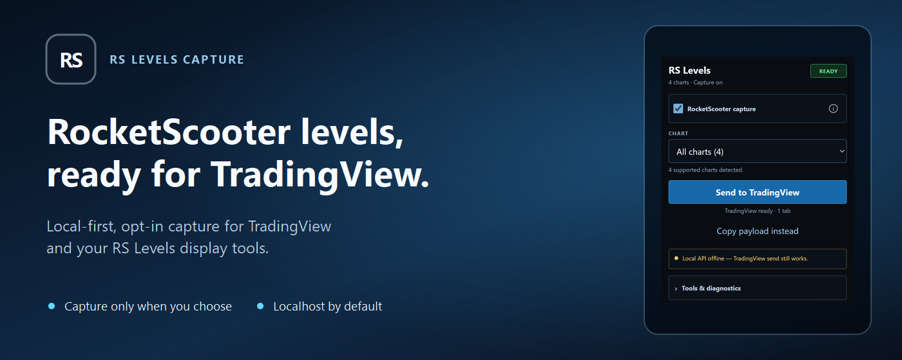
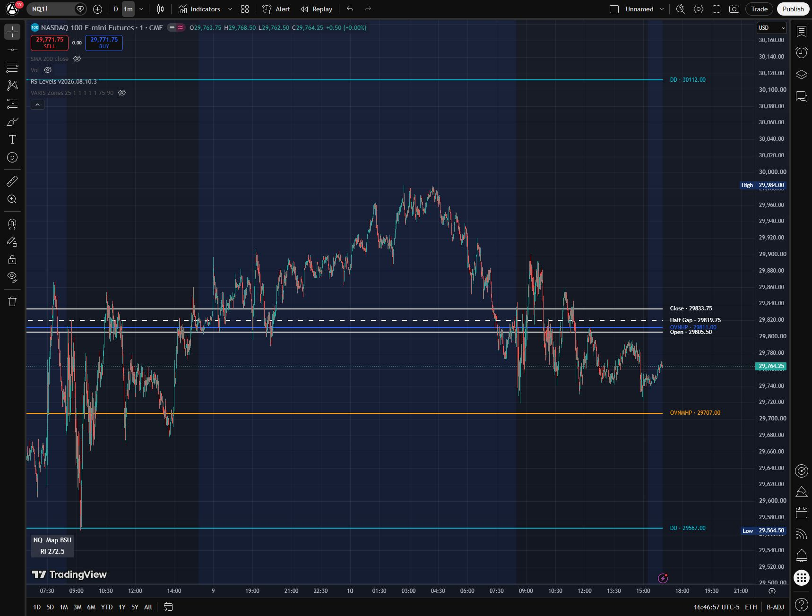
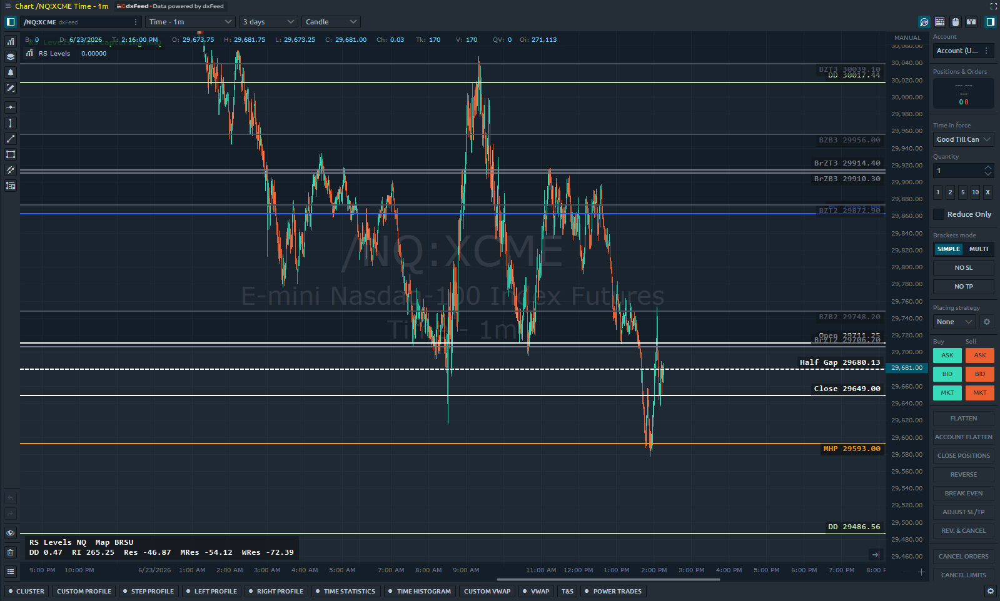

# RS Levels

<p align="center">
  
</p>

<p align="center"><strong>Local-first RocketScooter level and display-context capture feeds.</strong></p>

<p align="center">
  <a href="docs/tradingview-quickstart.md">TradingView quickstart</a>
  &nbsp;&bull;&nbsp;
  <a href="docs/index.md">Documentation</a>
  &nbsp;&bull;&nbsp;
  <a href="docs/platform-plugins.md">Platform plugins</a>
</p>

> [!IMPORTANT]
> **Community project:** RS Levels is independently created and maintained. It is not affiliated with, endorsed by, sponsored by, or officially supported by RocketScooter.

RS Levels lets a user capture level and display-context data from their own RocketScooter browser session, normalize it locally, and expose it through localhost APIs for display tools and charting-platform plugins.

## Included Feature Areas

RS Levels is organized around three display-only pieces:

- **Browser extension**: supports Chrome/Chromium and Firefox Desktop 140+ from one shared runtime, captures allowlisted RocketScooter display data from the user's own browser session, detects supported futures and stock charts currently open on the platform, provides an opt-in `Send to TradingView` settings-field handoff with an explicit copy fallback, scrubbed diagnostics, API docs links, and extension status/debug tools.
- **Local levels server**: runs on `http://127.0.0.1:8765` by default, normalizes the latest captured ES/MES and NQ/MNQ levels, exposes read-only JSON/text/SSE/OpenAPI endpoints, and can be explicitly configured for trusted private networks such as Tailscale.
- **Platform plugins, indicators, and studies**: includes TradingView Pine scripts, Sierra Chart ACSIL studies, NinjaTrader indicators, Quantower indicators, Bookmap add-on sources, and VARIS Zones support using captured risk interval (`RI`) where the platform can use it.

## See It in Action

<table>
  <tr>
    <td width="50%">
      <a href="screenshots/tradingview-levels.png">
        
      </a>
    </td>
    <td width="50%">
      <a href="screenshots/quantower-levels.png">
        
      </a>
    </td>
  </tr>
  <tr>
    <td align="center"><strong>TradingView RS Levels Indicator</strong></td>
    <td align="center"><strong>Quantower RS Levels Plugin</strong></td>
  </tr>
</table>

Prefer the unframed extension view? Open the [browser extension popup screenshot](screenshots/rslevels-extension.png).

## What This Is Not

- No trading strategy.
- No trade recommendations.
- No order entry, cancel, flatten, or broker execution.
- No account, PnL, batch, or trade-journal features.
- No redistribution of RocketScooter data.

Users must have their own RocketScooter access. This project only processes data already loaded in the user's browser and keeps it local by default.

## Choose Your Path

Use this table as the repo map. TradingView users can start with the extension and Pine indicator; the local server is still useful for diagnostics, API docs, examples, and direct platform plugins.

| Use case | Start here | Then use |
| --- | --- | --- |
| TradingView levels only | [TradingView quickstart](docs/tradingview-quickstart.md) | [TradingView reference](docs/tradingview.md) |
| TradingView VARIS Zones | [TradingView quickstart](docs/tradingview-quickstart.md) | [VARIS Zones](docs/varis-zones.md) |
| Local API, diagnostics, examples, or private-network setup | [Local API and extension setup](docs/user-setup.md) | [API](docs/api.md), [Networking](docs/networking.md) |
| Sierra Chart, NinjaTrader, Quantower, or Bookmap | [Local API and extension setup](docs/user-setup.md) | [Platform plugins](docs/platform-plugins.md) |
| API clients or display adapters | [API](docs/api.md) | [Schema reference](docs/schema-reference.md), [display plugin contract](docs/plugin-contract.md) |
| Packaging and release checks | [Packaging](docs/packaging.md) | [Release checklist](docs/release-checklist.md) |

The full documentation map lives in [docs/index.md](docs/index.md).

## Developer Quick Start

```powershell
npm test
npm start
```

Post public-safe demo levels after starting the service:

```powershell
npm run demo:capture
```

Create a release directory:

```powershell
npm run package
```

The release output includes a source-style directory, a source ZIP archive, standalone Chrome/Chromium and Firefox extension ZIPs, `RELEASE-MANIFEST.json`, `SHA256SUMS.txt`, and checksum sidecars.

Packaged users can start the local API with `npm start` or the wrappers in `scripts/start-local-service.*`.

OpenAPI spec: [docs/openapi.yaml](docs/openapi.yaml), also served at `http://127.0.0.1:8765/openapi.yaml` after startup. Local API docs: `http://127.0.0.1:8765/docs`.

Examples: `examples/html-dashboard`, `examples/node-client`, and `examples/python-client`.

Default service URL:

```text
http://127.0.0.1:8765
```

## Layout

```text
apps/
  browser-extension/
  local-service/
packages/
  schemas/
  core-parser/
plugins/
  manifest.json
  sierra-chart/
  ninjatrader/
  quantower/
  bookmap/
  tradingview/
examples/
  html-dashboard/
  node-client/
  python-client/
docs/
scripts/
```

## Status

Public-safe foundation in progress. The schema package, parser, exporter package, local service, browser extension, TradingView assisted handoff and paste-fallback workflow, display plugin sources, VARIS Zones source artifacts, release packaging, and public validation checklist are implemented with tests. Remaining work is primarily field validation against live RocketScooter/platform runtimes, persisted service settings, and native app packaging.
