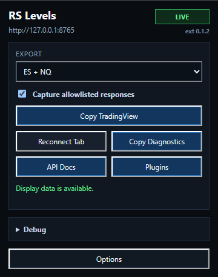

# Browser Extension

The RS Levels browser extension is the first-priority capture UX.

## What It Does

- Runs as a Manifest V3 extension.
- Loads only on RocketScooter app host patterns: `rocket.place` and `rocketscooter.com`.
- Injects a page hook at `document_start` so fetch/XHR responses can be observed from the page context.
- Captures only response URLs that match the configured allowlist.
- Falls back to a frame-aware display-only page reader for the TradingView charts currently open in RocketScooter, including futures display data and stock HP/MHP/liquidity-map data.
- Posts capture payloads to the local service at `/capture/api`.
- Provides a popup capture toggle plus TradingView payload copy, scrubbed diagnostics, local API docs, and display-plugin manifest workflows.
- Provides a popup `Reconnect Tab` action for the active RocketScooter tab when the extension was loaded after the page was already open.
- Keeps scrubbed capture-hook counters for observed, ignored, skipped, and posted responses in a collapsed debug section.
- Shows the extension version/build identity in the popup corner for support and diagnostics.

Manual chart levels are pass-through data. Users must add or keep overnight HP/MHP, yellow lines, red lines, and CAT lines visible in RocketScooter if they want those levels exported to TradingView payloads or direct platform plugins.

## What It Avoids

- No arbitrary page text scraping.
- No request auth data forwarding.
- No stored credentials.
- No strategy, broker, or automation behavior.
- No order-entry, cancel, flatten, account, position, or PnL capture.

## User Flow

1. Start the local service.
2. Load `apps/browser-extension` unpacked.
3. Open RocketScooter.
4. Check the popup status.
5. Use the capture toggle when you need to pause or resume allowlisted capture.
6. Choose a symbol from `Detected chart`. Only open charts with supported data appear; use `All detected charts` when more than one is available.
7. Use `Copy TradingView` for the selected export, then paste that `RSLEVELS|2` payload directly into `plugins/tradingview/rs-levels.pine` or `plugins/tradingview/varis-zones.pine`.
8. Use `Plugins` to inspect the local display-adapter manifest.
9. Use `Reconnect Tab` if the popup is waiting and the RocketScooter page was already open when the extension was loaded or reloaded.
10. Expand `Debug` when troubleshooting local API, extension, or stale-source setup.
11. Use `Copy Diagnostics` for a scrubbed support bundle.

The popup distinguishes live, waiting, offline, and stale source states so an old capture is not presented as live data.

Packaged releases include a standalone extension artifact at `dist/rs-levels-browser-extension-0.2.0.zip`. Unzip that artifact and load the extracted folder when you want a focused extension package instead of the full source tree.

The small popup build label shows the extension version. Packaged releases add the short git revision, for example `ext 0.2.0+abc1234`. The collapsed `Debug` section shows the local service version and packaged service revision when the running service exposes one. `Copy Diagnostics` includes both build identities.

The collapsed `Debug` section includes aggregate capture-hook counters and `Refresh status`, which manually re-reads the local API and extension state. Capture does not depend on this button.

Capture-hook counters are aggregate only:

- `Observed`: fetch/XHR responses seen by the page hook.
- `Ignored`: responses skipped because the URL did not match the allowlist.
- `Skipped`: allowlisted responses skipped because capture is disabled, too large, empty, non-text, or unreadable.
- `Hook`: the most recent scrubbed hook reason, including `hook-installed`, `settings-synced`, `published`, or skip reasons.

These counters do not include ignored URLs, response bodies, request headers, cookies, or page text.



The popup screenshot shows the normal capture controls. Current builds label the selector `Detected chart` and populate it from supported data in the open RocketScooter chart grid.

## Settings

Default service URL:

```text
http://127.0.0.1:8765
```

Default endpoint allowlist:

```text
level
levels
line
lines
chart
charts
ddband
ddbands
dd-band
band
bands
zone
zones
pivot
pivots
reference
references
indicator
indicators
hpa
tview/settings
tview/indicators
liq-map
liquidity
dyn-hp
db/sp
db/nq
```

Users can change these in the options page. The popup capture toggle updates the same capture-enabled setting. The allowlist is intentionally URL-substring based so users can adapt to harmless RocketScooter endpoint naming changes without code edits. Existing extension installs migrate older defaults to include these display-feed patterns after the extension reloads or updates.

Capture is not limited by the popup selection. The extension keeps the latest page-reader snapshot in memory so `Copy TradingView` can work without the local API. The selector is derived from payload-capable symbols in `tvWidget.chartsCount()/chart(i)`, not from RocketScooter's watchlist table. Futures contract symbols continue to normalize to public `ES` and `NQ` families. Stock charts use their ticker, so an open `NVDA` chart with HP, MHP, or map context produces an `NVDA` choice and payload section. A watchlist row alone does not create a choice.

When the page reader is active, it posts a synthetic `/page-reader/display` capture through the same local `/capture/api` endpoint. That fallback is intentionally display-only: it runs in RocketScooter child frames as well as the top page, reads TradingView chart shapes and study plots, emits level names/prices/kinds/colors, and includes `chartLines`, `referenceLines`, and `zoneRectangles` arrays. Futures keep their existing zone, manual-line, reference, and stat extraction. Detected stocks can add visible HP/MHP prices and a liquidity-map code from the matching scanner row. Scanner rows are consulted only for symbols already detected in the open chart grid, so the full watchlist is never turned into popup options. The reader does not read whole-page text or transmit browser credentials, request headers, cookies, account data, or order/execution state.

Because these manual lines are read from RocketScooter's visible chart state, changing them in RocketScooter requires a fresh capture before downstream indicators/studies/plugins can update.

## Tailscale And Private Networks

For local-only use, keep the default service URL. For Tailscale or another trusted private network, start the local service with remote access explicitly enabled and then set the extension service URL to that private address.

When a non-default service URL is saved, Chrome will ask for permission to reach that specific origin. The broad optional host permission exists only so the extension can support user-selected localhost, LAN, and Tailscale service URLs without granting those origins by default.

The extension does not discover or broadcast service locations.
