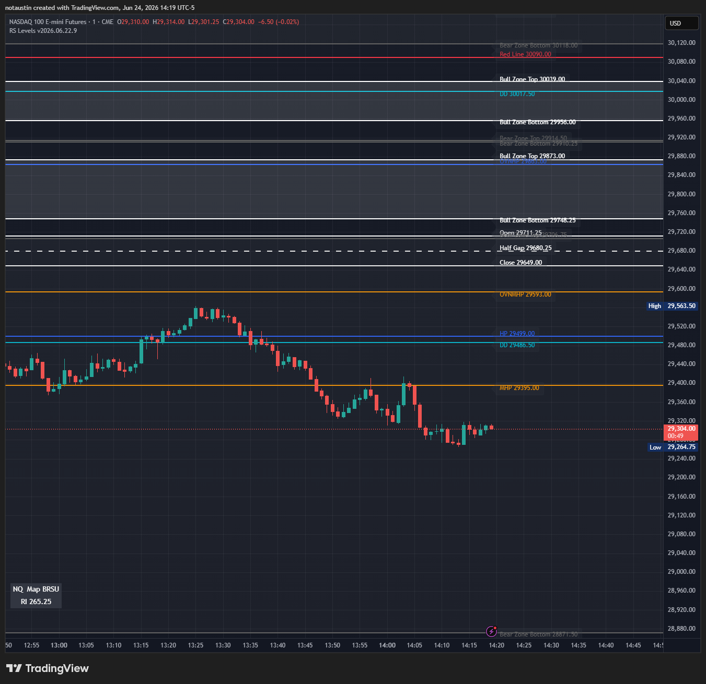

# TradingView Quickstart

This is the short path for users who only want RocketScooter levels on TradingView. For other workflows, see [Getting started](getting-started.md).

You need two pieces:

- the `RS Levels Capture` browser extension
- the `RS Levels` TradingView indicator from `plugins/tradingview/rs-levels.pine`

The local API service is optional for this workflow. It is useful for diagnostics, API docs, and direct Sierra/NinjaTrader/Quantower/Bookmap plugins, but TradingView itself only needs a copied `RSLEVELS|2` payload.

## 1. Load The Extension

1. Open `chrome://extensions` in a Chromium-based browser.
2. Enable developer mode.
3. Choose `Load unpacked`.
4. Select one of these folders:
   - `apps/browser-extension` from this repository
   - `dist/rs-levels-0.0.0/apps/browser-extension` from a full release package
   - the extracted standalone `rs-levels-browser-extension` folder
5. Pin `RS Levels Capture` so the popup is easy to open.

## 2. Open RocketScooter

1. Open RocketScooter in the same browser profile.
2. Keep the futures or stock charts you want to copy open in the RocketScooter chart grid.
3. If RocketScooter was already open before loading or reloading the extension, click `Reconnect Tab` in the extension popup, then refresh RocketScooter data or reload the RocketScooter tab.

The extension captures supported display data from open RocketScooter charts. Futures keep their complete RS Levels capture. Stock charts can provide HP, MHP, and liquidity-map context. Watchlist rows alone are ignored, as are broker panels, account data, order-entry controls, and execution data.

## 3. Add Optional Manual RocketScooter Lines

RS Levels passes through display levels that RocketScooter exposes. It does not invent optional manual levels.

If you want these items to appear in TradingView, add or keep them visible on the matching RocketScooter chart before copying the payload:

- overnight HP and overnight MHP
- yellow lines
- red lines
- CAT lines

For futures, add them on the ES/MES or NQ/MNQ chart family you care about. For a stock such as NVDA, keep its stock chart open so detected HP, MHP, and map context can be included. After changing a chart or manual line, refresh/reconnect the RocketScooter tab if needed, then copy a fresh TradingView payload.

## 4. Add The TradingView Indicator

1. In TradingView, open the matching chart, such as `NVDA`, `ES1!`, `MES1!`, `NQ1!`, or `MNQ1!`.
2. Open Pine Editor.
3. Paste the contents of `plugins/tradingview/rs-levels.pine`.
4. Save the script.
5. Add it to the chart.

Leave `Chart family` on `Auto`. Stock charts match their ticker section; ES/MES charts use `ES`, and NQ/MNQ charts use `NQ`. The manual ES/NQ choices are futures overrides.

`Label layout` defaults to `Rail`, which docks readable chips near the chart's right boundary. Choose `On line` for lightweight text next to each price line or `Hidden` to show only the lines and fills.

## 5. Copy And Paste Levels

1. Open the `RS Levels Capture` popup on the RocketScooter tab.
2. Choose the detected chart you want, or `All detected charts` when more than one supported chart is open.
3. Click `Copy TradingView`.
4. Open the TradingView indicator settings.
5. Paste into `RS Levels Payload`.
6. Click `OK`.

One copied payload can carry multiple detected tickers and futures families. You can paste the same payload into matching TradingView charts; each chart draws its own section in `Auto`.

TradingView Pine cannot poll RocketScooter or localhost directly. When RocketScooter levels change, copy a fresh payload from the extension and paste it into the indicator again.

When the paste is working, the chart should show the display-only RS Levels overlay: DD bands, HP/MHP, user-added yellow/red/CAT lines, open/close references, bull and bear zones, and the small map/RI panel.

## What Should Appear

The indicator can draw:

- DD bands
- HP and MHP levels
- open, close, and Half Gap levels
- user-added yellow lines, red lines, and CAT lines
- bull and bear zone boundaries and fills
- a small stats panel with liquidity map and RI when RocketScooter exposes them

User-added lines appear only when they were added in RocketScooter and included in the latest capture.

## Troubleshooting

- `Copy TradingView` can still work when the popup says the local service is offline, because the extension tries its own latest RocketScooter page-reader capture first.
- If `Copy TradingView` says no extension-captured levels are available, click `Reconnect Tab`, then reload RocketScooter or refresh the chart data.
- If stock levels paste but do not draw, confirm the TradingView ticker exactly matches the detected RocketScooter ticker and leave `Chart family` on `Auto`.
- If futures levels paste but do not draw, confirm the chart is ES/MES or NQ/MNQ. If needed, force `ES` or `NQ`.
- If you need a support bundle or want to inspect API state, start the local service with `npm start`, then use `Copy Diagnostics` in the popup.

## Safety Boundary

The extension and TradingView indicator are display-only. They do not place orders, cancel orders, flatten positions, read account data, read PnL, or run trading automation.
